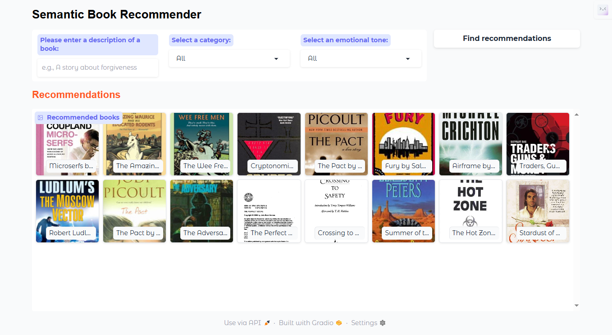

# Semantic Book Recommender

  <!-- Replace with the actual link to your dashboard image -->

## Overview

The **Semantic Book Recommender** is an intelligent recommendation system developed using Python and Natural Language Processing (NLP) techniques. This project leverages Large Language Models (LLMs) to analyze book descriptions and provide personalized book recommendations based on user inputs, emotions, and categories.

## Features

- **Smart Recommendations**: Utilizes semantic understanding for accurate content matching.
- **Emotion Analysis**: Classifies book descriptions based on seven emotions for nuanced recommendations.
- **User-Friendly Dashboard**: Integrated with Gradio for easy querying and interaction.
- **Dynamic Filtering**: Allows filtering by genre and emotional tone.

## Tech Stack

- **Python**: Programming language used for development.
- **Transformers**: Hugging Face’s library for state-of-the-art NLP models.
- **Pandas**: For data manipulation and analysis.
- **Gradio**: To build the interactive frontend dashboard.
- **LangChain**: For managing the vector database and text processing.
- **Kaggle API**: For easy access to datasets.

## Getting Started

### Prerequisites

Make sure you have the following installed:

- Python 3.x
- pip (Python package installer)

### Installation

1. Clone the repository:
   ```bash
   git clone https://github.com/yourusername/semantic-book-recommender.git
   ```
  
2. Change into the project directory:
   ```bash
   cd semantic-book-recommender
   ```

3. Install the required libraries:
   ```bash
   pip install -r requirements.txt
   ```

### Dataset

The project uses a dataset of books (`books.csv`) that contains the following columns:

- **ISBN**: Unique identifier for each book.
- **Description**: Textual description of the book.
- **Category**: Genre or category of the book.
- **Ratings**: User ratings (may contain missing values).

### Running the Application Locally

To run the application locally:

1. Start the Gradio interface:
   ```bash
   python app.py
   ```

2. Access the app in your web browser at `http://localhost:7860`.

## Deployment

The Semantic Book Recommender is also deployed and accessible online. You can try the live application at:

[Live Demo](link-to-your-deployed-app)  <!-- Replace with the actual link to your deployed app -->

## Usage

1. Input a book description or keywords in the query box.
2. Select emotional tone or category (optional).
3. Click "Recommend" to receive a list of book recommendations based on your input.

## Example of Functionality

- Input: _"I am looking for a heartwarming children’s book about nature."_
- Output: Recommendations of books that match the user’s query and emotional tone.

## Future Plans

- Improve recommendation accuracy with further fine-tuning of LLMs.
- Add support for more languages.
- Expand the user interface with additional features based on user feedback.

## Contributing

Feel free to fork the repository and submit pull requests. Any contributions are welcome!

### License

This project is licensed under the MIT License. See the [LICENSE](LICENSE) file for details.

## Acknowledgments

- [Hugging Face](https://huggingface.co) for their fantastic NLP models and libraries.
- Gradio for making interactive web applications easy.
- Kaggle for providing the dataset.
